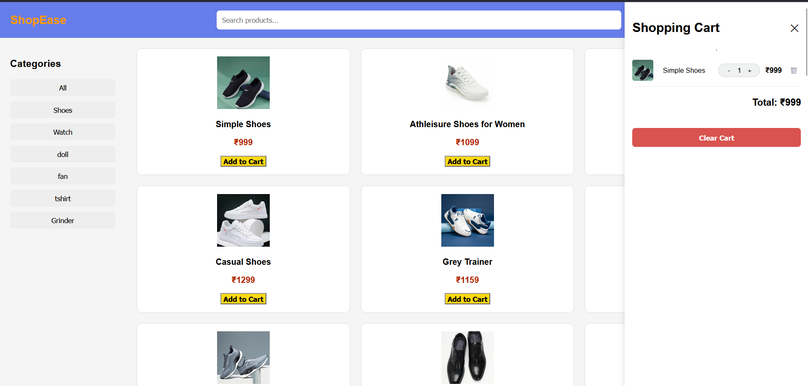

# 🛒 E-Commerce Store

A modern and responsive **eCommerce Store** built using **HTML, CSS, and JavaScript**. ShopEase provides a clean shopping experience where users can browse products, search items, filter by categories, and manage their shopping cart with real-time updates.

---

## 🚀 Live Demo

🔗 https://ecommerce-store-sainath-app.netlify.app/

---

## 📸 Preview



---

## ✨ Features

* 🛒 Browse products in a responsive grid layout
* 🔍 Search products instantly
* 📂 Filter products by category
* ➕ Add products to the shopping cart
* ➖ Increase or decrease product quantity
* 🗑️ Remove individual items from the cart
* 💰 Real-time cart total calculation
* 🧹 Clear the entire shopping cart
* 📱 Fully responsive design for desktop and mobile
* ⚡ Smooth and user-friendly interface

---

## 🛠️ Built With

* HTML5
* CSS3
* JavaScript (ES6)

---

## 📂 Project Structure

```text
ShopEase/
│
├── index.html
├── style.css
├── script.js
├── images/
├── screenshot.png
└── README.md
```

---

## 🧠 What I Learned

This project helped me improve my understanding of:

* DOM Manipulation
* JavaScript Arrays & Objects
* Event Handling
* Dynamic Rendering
* Search Functionality
* Category Filtering
* Shopping Cart Logic
* Quantity Management
* Responsive Web Design

---

## ▶️ How to Run

1. Clone the repository

```bash
https://github.com/sairaj-086/ecommerce-store
```

2. Open the project folder.

3. Open `index.html` in your browser.

---

## 📌 Key Functionalities

✔ Product Listing

✔ Product Search

✔ Category Filter

✔ Add to Cart

✔ Increase/Decrease Quantity

✔ Remove Product

✔ Cart Total Calculation

✔ Clear Cart

✔ Responsive UI

---

## 🚀 Future Improvements

* ❤️ Wishlist
* 🔐 User Authentication
* 💳 Payment Gateway Integration
* 📦 Product Details Page
* ⭐ Product Ratings & Reviews
* 🔄 Sorting Options
* 💾 Local Storage / Database Support
* 🌙 Dark Mode

---

## 👨‍💻 Author

**Sairaj**

Feel free to explore the project, suggest improvements, or contribute.

If you like this project, don't forget to ⭐ the repository!


## Future Improvements

* User Authentication
* Payment Integration
* Product Search
* Product Filtering
